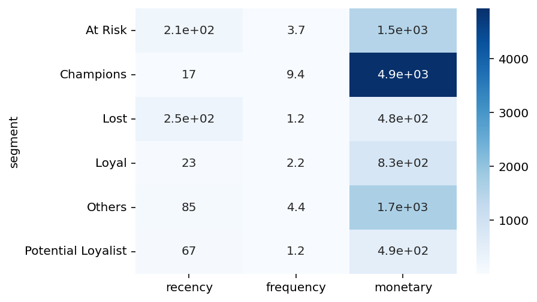
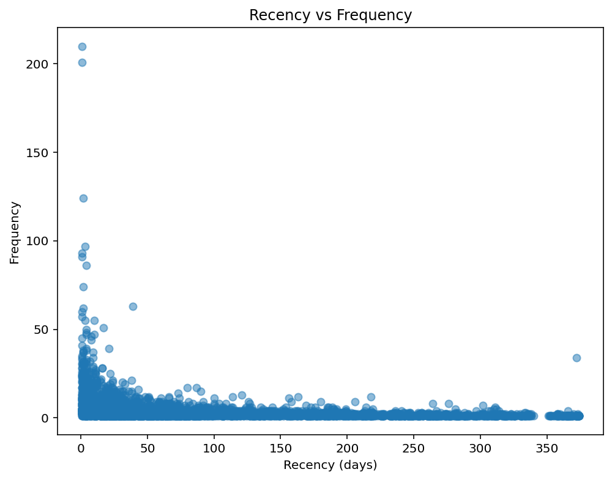

# 📊 RFM Customer Segmentation using Online Retail Dataset

This project performs **RFM (Recency, Frequency, Monetary)** customer segmentation using the **Online Retail** dataset from Kaggle.  
It groups customers into meaningful segments such as **Champions**, **Loyal Customers**, **At Risk**, **Lost**, and more—helping businesses understand customer value and retention patterns.

---

## 📁 Dataset Source

This project uses the **Online Retail Dataset**, originally from the  
**UCI Machine Learning Repository**, mirrored on Kaggle:

🔗 Dataset link:  
https://www.kaggle.com/datasets/tunguz/online-retail

⚠️ *The dataset is NOT included in this repository due to size and licensing restrictions.*

---

## 🛠️ Technologies Used

- Python  
- Pandas  
- NumPy  
- Matplotlib  
- Seaborn  
- Jupyter Notebook / VSCode  
- GitHub  

---

## 🧮 RFM Methodology

For each customer:

- **Recency** → Days since last purchase  
- **Frequency** → Number of transactions  
- **Monetary** → Total money spent  

Each metric is divided into 4 quantile-based scores (1–4), then combined:
RFM Score = R_score + F_score + M_score

Based on this score, customers are segmented into:

- **Champions**
- **Loyal Customers**
- **Potential Loyalists**
- **At Risk**
- **Hibernating / Lost**
- **Others**

---

## 📊 Visual Outputs

The script generates several visualizations stored in the **images/** folder:

### Customer Segments Distribution


### Average RFM Values by Segment


### Recency vs Frequency Scatter Plot


---

## 🚀 How to Run the Project

### 1. Clone the repository
```bash
git clone https://github.com/masciavelucasv/rfm-customer-segmentation.git
cd rfm-customer-segmentation
```

### 2. Install dependencies
```bash
pip install -r requirements.txt
```

### 3. Run the analysis script
```bash
python rfm_customer_analysis.py
```

### Output files created:
- `rfm_output.csv` — final RFM table  
- Charts saved in the `images/` folder  

---

## 🧭 Insights From the Analysis

Champions are the largest customer group, indicating a strong core of high-value customers.

Lost customers form the second-largest segment, suggesting retention issues.

At Risk customers are relatively few, but they have very high monetary value, meaning they are worth re-engaging.

Potential Loyalists show high future value, with good spending but lower recency.

Most customers purchase infrequently, as seen in the low-frequency scatter patterns.

Recency distribution shows many customers haven’t purchased for over 200+ days, aligning with the high Lost segment.

Champions strongly outperform all other groups in monetary value, confirming them as the main revenue drivers.
---

## 📜 License

This project is released under the **MIT License**.  
Dataset rights belong to UCI / Kaggle.

---


